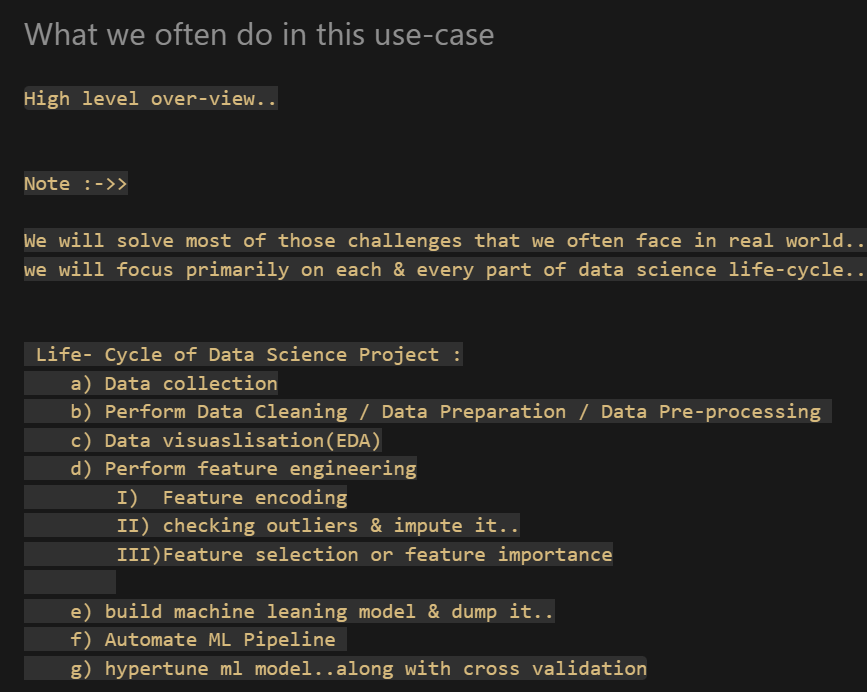

# ✈️ Airline Fare Prediction

## 📌 Project Overview

Airline ticket prices can vary significantly depending on factors such as airline, source, destination, journey date, departure time, arrival time, duration, and number of stops.

The objective of this project is to build a Machine Learning model that can predict airline ticket prices based on these travel-related features.

This project follows an end-to-end Data Science and Machine Learning workflow, starting from data preprocessing and exploratory data analysis and progressing towards model optimization and evaluation.

---

## 🎯 Project Objective

- Analyse factors affecting airline ticket prices
- Clean and preprocess the dataset
- Perform Exploratory Data Analysis (EDA)
- Create meaningful features through feature engineering
- Encode categorical variables
- Detect and analyse outliers
- Build multiple regression models
- Evaluate model performance using multiple metrics
- Perform hyperparameter optimization
- Evaluate the optimized model on unseen data

---

# 🔄 Project Workflow

Data Collection
      ↓
Data Loading & Understanding
      ↓
Data Cleaning
      ↓
Exploratory Data Analysis (EDA)
      ↓
Feature Engineering
      ↓
Feature Encoding
      ↓
Outlier Analysis
      ↓
Train-Test Split
      ↓
Model Building
      ↓
Model Evaluation
      ↓
Hyperparameter Tuning
      ↓
Final Model Evaluation

---

# 1. 📂 Data Collection & Loading

The airline fare dataset was loaded and inspected to understand its structure, features, data types, and target variable.

### Dataset Features

* `Airline`
* `Date_of_Journey`
* `Source`
* `Destination`
* `Route`
* `Dep_Time`
* `Arrival_Time`
* `Duration`
* `Total_Stops`
* `Additional_Info`
* `Price`

The target variable for this project is:

**`Price`**

Since the target variable is continuous, this is treated as a **Supervised Regression Problem**.

---

# 2. 🧹 Data Cleaning & Preprocessing

The dataset was inspected for:

* Missing values
* Incorrect data types
* Inconsistent categorical values
* Unnecessary columns
* Data formatting issues

### Data preprocessing included:

* Checking dataset shape and structure
* Inspecting column data types using `info()`
* Checking missing values
* Converting date and time features into appropriate formats
* Handling inconsistent categorical values
* Removing unnecessary features where appropriate

---

# 3. 🔍 Exploratory Data Analysis

Exploratory Data Analysis was performed to understand patterns and relationships within the dataset.

### Analysis included:

* Airline frequency analysis
* Price distribution
* Average price by airline
* Route analysis
* Source and destination analysis
* Departure time analysis
* Relationship between number of stops and fare
* Analysis of flight duration
* Outlier analysis

Visualizations were used to better understand the distribution and relationships between features and airline prices.

---

# 4. ⚙️ Feature Engineering

Feature engineering was performed to transform the existing features into more useful representations for Machine Learning.

### Features created included:

#### Journey Date

The journey date was transformed into separate components such as:

* Journey Day
* Journey Month
* Journey Year

#### Departure Time

Departure time was decomposed into:

* Departure Hour
* Departure Minute

A categorical departure-time feature was also created to classify flights into groups such as:

* Early Morning
* Morning
* Noon
* Evening
* Night
* Late Night

#### Arrival Time

Arrival time was decomposed into:

* Arrival Hour
* Arrival Minute

#### Dep_Time_hrs

* Dep_Time_hrs is composed into:
* Early Morning
* Morning
* AfterNoon
* Night
* Late Night

These transformations make the information easier for Machine Learning algorithms to process.

---

# 5. 🔢 Feature Encoding

Machine Learning algorithms require numerical input, so categorical variables were converted into numerical representations.

### Encoding techniques used included:

* One-Hot Encoding
* Mapping categorical values to numerical representations
* Ordinal representation where an inherent order existed

Examples of categorical features processed include:

* Airline
* Source
* Destination
* Total Stops

The encoding approach was selected based on the nature of each feature.

---

# 6. 📊 Outlier Analysis

Outliers were analysed to identify observations that were significantly different from the general distribution of the data.

The **Interquartile Range (IQR)** method was used for detecting potential outliers.

### IQR Formula

IQR = Q3 - Q1

Potential outlier boundaries:

Lower Bound = Q1 - 1.5 × IQR

Upper Bound = Q3 + 1.5 × IQR

Outliers were not automatically treated as incorrect data. They were analysed in the context of airline pricing because unusually high fares may represent genuine situations such as premium tickets or different travel conditions.

---

# 7. 🤖 Machine Learning Models

Since the target variable `Price` is continuous, regression algorithms were used.

The following models were explored:

### Linear Regression

Used as a baseline regression model to understand the relationship between the input features and ticket price.

### Decision Tree Regression

Used to capture non-linear relationships and interactions between features.

### Random Forest Regression

Used as an ensemble tree-based model capable of capturing more complex relationships by combining multiple decision trees.

Multiple algorithms were compared rather than assuming that a single algorithm would perform best.

---

# 8. 📈 Model Evaluation

The models were evaluated using multiple regression metrics.

### Evaluation Metrics

* **R² Score**
* **Mean Absolute Error (MAE)**
* **Mean Squared Error (MSE)**
* **Root Mean Squared Error (RMSE)**
* **Mean Absolute Percentage Error (MAPE)**

These metrics provide different perspectives on model performance.

Error distributions were also analysed to understand how the model's prediction errors were distributed.

---

# 9. 🎯 Hyperparameter Tuning

After comparing the initial models, hyperparameter optimization was performed on the selected tree-based model.

### Hyperparameters considered included:

* `n_estimators`
* `max_depth`
* `min_samples_split`
* `min_samples_leaf`

A hyperparameter search space was created containing different possible values for these parameters.

---

## RandomizedSearchCV

`RandomizedSearchCV` was used to explore different combinations of hyperparameters efficiently.

The search was performed using **3-fold cross-validation** on the training data.

### Configuration

Estimator
    ↓
Random Forest Regression

Hyperparameter Search
    ↓
RandomizedSearchCV

Cross-Validation
    ↓
3-Fold CV

Search Space
    ↓
n_estimators
max_depth
min_samples_split
min_samples_leaf

Output
    ↓
Best Parameters
Best CV Score

The best-performing hyperparameter configuration was identified based on the selected cross-validation scoring metric.

---

# 10. 🧪 Final Model Evaluation

After hyperparameter optimization, the optimized model was evaluated using the separate test dataset.

The test dataset was kept separate from the hyperparameter search so that it could provide an evaluation of the model's performance on unseen data.

Final evaluation included:

* R² Score
* MAE
* MSE
* RMSE
* MAPE
* Prediction error analysis

---

# 🧠 Key Learnings

Through this project, I gained practical experience in:

* Data Cleaning
* Data Preprocessing
* Exploratory Data Analysis
* Feature Engineering
* Feature Encoding
* Outlier Detection
* Regression Modelling
* Model Evaluation
* Cross-Validation
* Hyperparameter Optimization
* Model Comparison
* Error Analysis

The project helped me understand how a Machine Learning problem moves from **raw data to a trained and optimized predictive model**.

---

# 🚀 Future Improvements

* Build a complete automated ML pipeline
* Perform more extensive hyperparameter optimization
* Experiment with additional regression algorithms
* Apply advanced feature selection techniques
* Improve error analysis
* Save the final trained model for deployment
* Develop a user interface for airline fare prediction
* Deploy the prediction system as a web application

---

# 🛠️ Technologies Used

* Python
* Pandas
* NumPy
* Matplotlib
* Seaborn
* Plotly
* Cufflinks
* Scikit-learn
* Jupyter Notebook
* Pickle

---

# 📌 Project Status

**Currently in development**

The project is being developed step-by-step, from data preprocessing and exploratory analysis to machine learning model optimization and final evaluation.

### One important thing

For your **final README**, we should later replace the general statements with your **actual project results**, for example:

Model              R²       MAE       RMSE
------------------------------------------------
Linear Regression   ...
Decision Tree       ...
Random Forest       ...
Tuned Random Forest ...

And your actual:

* `best_params_`
* `best_score_`
* final test R²
* MAE
* RMSE
* MAPE
t.
